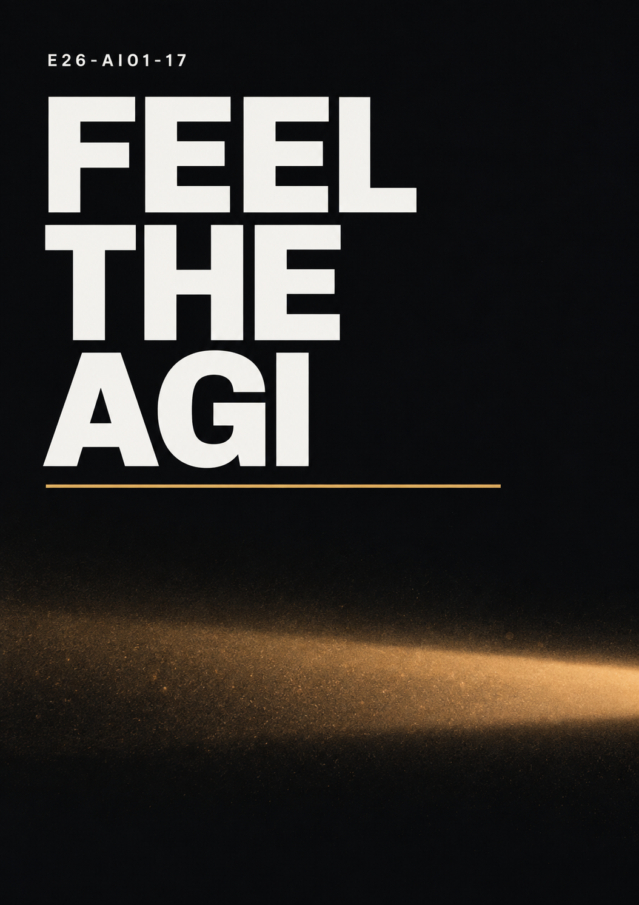

# E26-AI01-17

## 팀 슬로건

> Feel the AGI

## 팀 포스터

  

## 1. 팀원 소개

| 이름 | 학번 | 전공 | 관심사 | 꿈꾸는 미래 |
| --- | --- | --- | --- | --- |
| 박지형 | 23학번 | 인공지능전공 | 게임, XR, 생성형 AI | XR 분야에서 사용자의 몰입도를 높이는 연구 |
| 김성빈 | 26학번 | 인공지능전공 | AI Agent, AX, AGI, ASI | AGI와 ASI의 발전을 통해 인간의 삶의 질을 향상시키는 것 |
| 홍명운 | 26학번 | 인공지능전공 | 금융, 테니스, 생성형 AI | 증권사 펀드매니저로 경험을 쌓고 자신의 회사를 창업하는 것 |
| 김수영 | 26학번 | 인공지능전공 | 게임, 항공우주, AI | 미래 항공우주산업 분야에 종사하는 것 |

## 팀 소개

우리 팀은 인공지능을 중심으로 XR, 금융, 항공우주 등 서로 다른 분야에 관심을 가지고 있다.

각자의 진로는 다르지만, 인공지능과 AI Agent가 미래 산업과 사회를 크게 변화시킬 것이라는 점에 공통적으로 관심을 가지고 있다.

팀 슬로건인 **Feel the AGI**에는 빠르게 발전하는 인공지능 기술을 직접 경험하고, 그 변화 속에서 각자가 원하는 미래를 만들어 가자는 의미를 담았다.

## 2. 공통된 관심사

우리 팀의 공통된 관심사는 게임과 AI Agent이다.

팀원 모두 게임을 즐기며, 최근 발전하고 있는 AI Agent 기술에도 관심을 가지고 있다.

AI Agent가 단순히 질문에 답하는 인공지능을 넘어 사용자의 목표를 이해하고 직접 작업을 수행하는 방향으로 발전하고 있다는 점이 흥미로웠다.

또한 인공지능이 게임, XR, 금융, 항공우주 등 서로 다른 분야에서 어떻게 활용될 수 있는지 알아보고 싶다.

## 3. 서로 다른 관심사

박지형은 XR 기술을 활용하여 사용자의 몰입도를 높이는 연구에 관심이 있다.

김성빈은 AI Agent와 AX, AGI, ASI와 같은 최신 인공지능 기술과 인공지능이 사회 전체에 가져올 변화에 관심이 있다.

홍명운은 인공지능을 전공하고 있지만 금융 분야로 진출하는 것을 목표로 하고 있으며, 장기적으로는 자신의 회사를 창업하고 싶어 한다.

김수영은 인공지능 기술이 미래 항공우주산업에서 어떻게 활용될 수 있는지에 관심이 있다.

서로 다른 진로를 가지고 있다는 점에서 인공지능이 특정 분야에만 한정되지 않고 다양한 산업과 연결될 수 있다는 것을 알 수 있었다.

## 4. 특별히 알아보고 싶은 것

- 인공지능전공 학생이 금융이나 경영 등 문과 계열 분야로 진출한 사례
- AI Agent와 AX의 실제 산업 활용 사례
- 생성형 AI를 실제 프로젝트에 활용하는 방법
- XR과 인공지능을 결합하여 사용자 몰입도를 높이는 방법
- 항공우주산업에서 인공지능이 활용되는 방식
- 인공지능에서 선형대수가 실제로 어떻게 활용되는지
- AGI와 ASI의 발전 가능성과 사회에 미칠 영향

## 5. 개설되었으면 하는 교과목

우리 팀은 생성형 AI와 AI 활용 방법을 직접 다룰 수 있는 교과목이 개설되었으면 좋겠다고 생각했다. (스탠퍼드 CS146S와 같은 과목)

특히 단순히 이론만 배우는 것이 아니라 실제 생성형 AI와 AI Agent를 활용하여 프로젝트를 수행하는 수업에 관심이 있다.

또한 빠르게 변화하는 인공지능 분야의 특성을 고려하여 최신 기술과 트렌드를 지속적으로 반영하는 교과목이 필요하다고 생각한다.

예를 들어 AI Agent, AX, 생성형 AI, 멀티모달 AI 등 현재 산업에서 빠르게 발전하고 있는 기술을 직접 실습하고 활용해 보는 형태의 수업이 있었으면 좋겠다.

인공지능의 기초가 되는 선형대수가 실제 AI 모델에서 어떻게 사용되는지를 응용 중심으로 배우는 과목에도 관심이 있다.

## 6. 우리가 그리는 미래

우리 팀이 생각하는 미래는 인공지능이 하나의 독립된 분야가 아니라 다양한 산업과 자연스럽게 결합되는 미래이다.

XR에서는 더욱 몰입감 있는 경험을 제공하고, 금융에서는 데이터를 분석하여 더 나은 의사결정을 지원하며, 항공우주 분야에서는 복잡한 시스템을 효율적으로 운영하는 데 인공지능이 활용될 수 있다.

또한 AI Agent와 AGI 기술이 발전하면서 인공지능은 단순한 도구를 넘어 사람과 함께 문제를 해결하는 협력자로 발전할 가능성이 있다.

우리는 이러한 기술 발전을 직접 경험하고 활용하면서 각자가 원하는 분야에서 새로운 가치를 만들어 가고 싶다.
